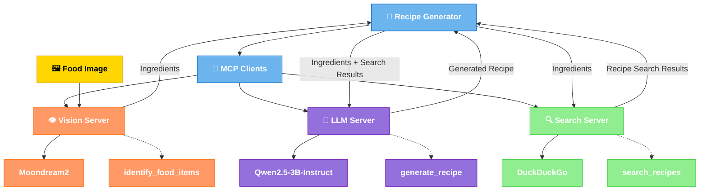

# Multi-Modal Recipe Generator with MCP Architecture


A simple, effective multi-modal agent that generates recipes from food images using the Model Context Protocol (MCP) with a microservices architecture. This project demonstrates how to orchestrate vision, search, and language models to create a practical AI application optimized for Intel GPUs.

## 🌟 Features

- **Food Recognition**: Identifies ingredients in food images using Moondream2 vision model
- **Recipe Search**: Finds relevant recipes based on identified ingredients using DuckDuckGo
- **Recipe Generation**: Creates detailed, formatted recipes using Qwen2.5-3B-Instruct
- **Microservices Architecture**: Modular design with separate vision, search, and LLM servers
- **Intel GPU Optimization**: Accelerated with Intel Extension for PyTorch (IPEX)
- **Docker Deployment**: Simple containerization for easy deployment
- **Standardized Communication**: Model Context Protocol (MCP) for seamless orchestration

## 📝️ Recipe Generation Architecture



## 🍳 Recipe Generation from Food Images

This multi-modal agent specializes in generating recipes based on food items detected in images:

1. **Vision Analysis**: The vision server (using Moondream2) identifies food items in the provided image
2. **Recipe Search**: The search server finds relevant recipes based on the identified ingredients
3. **Recipe Generation**: The LLM server generates a complete, formatted recipe using both the ingredients and search results

This demonstrates a practical application of multi-modal AI for everyday use cases, combining computer vision, web search, and natural language generation.

## 🍳 Recipe Generation Workflow

The recipe generation process follows a simple, effective workflow:

1. **Image Analysis**: The Moondream2 vision model analyzes a food image to identify ingredients
2. **Ingredient Extraction**: The system extracts a list of identified food items
3. **Recipe Search**: Using the ingredients list, the system searches for relevant recipes via DuckDuckGo
4. **Recipe Generation**: The Qwen2.5-3B-Instruct model combines the ingredients and search results to generate a complete recipe
5. **Formatting**: The recipe is formatted with a title, description, ingredients list, step-by-step instructions, and cooking time

This straightforward workflow demonstrates how multiple AI services can be orchestrated to create a practical application that provides immediate value to users.

## 🤚 Components

### Vision Server

- **Purpose**: Analyzes food images to identify ingredients
- **Model**: Moondream2, a lightweight vision-language model
- **Tools**: `identify_food_items` - detects and lists food ingredients in images
- **Optimization**: Intel XPU acceleration with IPEX

### LLM Server

- **Purpose**: Generates complete, formatted recipes
- **Model**: Qwen2.5-3B-Instruct, an efficient instruction-tuned language model
- **Tools**: `generate_recipe` - creates recipes based on ingredients and search results
- **Optimization**: Intel XPU acceleration with IPEX

### Search Server

- **Purpose**: Finds relevant recipes based on identified ingredients
- **Engine**: DuckDuckGo search integration
- **Tools**: `search_recipes` - searches for recipes using the identified ingredients

### Client Application

- **Purpose**: Orchestrates the workflow between vision, search, and LLM servers
- **Pattern**: Simple, sequential processing pipeline
- **Tools**: MCP client for standardized communication between services
- **Process**: 
  - Sends images to the vision server for ingredient identification
  - Forwards ingredients to the search server for recipe search
  - Combines ingredients and search results for the LLM server
  - Returns the generated recipe to the user
- Manages error handling and recovery
- Provides the final results

## 💻 Installation

### Prerequisites

- Python 3.10+
- Docker and Docker Compose (for containerized deployment)
- Intel GPU with XPU drivers (for hardware acceleration)

### Clone the Repository

```bash
git clone https://github.com/gulguluu/multi_modal_agent.git
cd multi_modal_agent
```

### Prepare Sample Data

Create a data directory for food images:

```bash
mkdir -p mcp_agent/data
```

You can add your own food images to this directory, or use the sample image included in the repository.

### Running with Docker Compose

1. Build and start the services:

```bash
cd mcp_agent/docker
docker-compose build
docker-compose up -d vision-server llm-server search-server
```

2. Run the client with a food image:

```bash
docker-compose run client python /app/client/agent_client.py --image /app/data/ingredients.jpg
```

Or with a URL to a food image:

```bash
docker-compose run client python /app/client/agent_client.py --url https://images.unsplash.com/photo-1606787366850-de6330128bfc
```

3. The system will:
   - Identify food items in the image
   - Search for recipes using those ingredients
   - Generate a complete recipe with instructions

## 📊 Performance Optimization

This project is optimized for Intel GPUs using Intel Extension for PyTorch (IPEX):

- **Model Optimization**: Models are optimized for Intel XPU hardware
- **Efficient Inference**: Fast ingredient recognition and recipe generation
- **Memory Management**: Efficient caching of models and results
- **Docker Volumes**: Persistent model storage to avoid repeated downloads

The system is designed to be simple yet effective, providing a practical example of multi-modal AI orchestration on Intel hardware.

## 🔁 Recipe Generation Example

1. **Image Analysis**:
   ```
   Input: ingredients.jpg (image of tomatoes, onions, chicken, garlic)
   Output: ["tomatoes", "onions", "chicken", "garlic"]
   ```

2. **Recipe Search**:
   ```
   Input: "tomatoes, onions, chicken, garlic"
   Output: [Search results for recipes with these ingredients]
   ```

3. **Recipe Generation**:
   ```
   Input: Ingredients + Search Results
   Output: 
   
   # Garlic Tomato Chicken
   
   A delicious one-pan meal using fresh ingredients.
   
   ## Ingredients:
   * 2 chicken breasts, diced
   * 3 tomatoes, chopped
   * 1 onion, sliced
   * 4 cloves garlic, minced
   * 2 tbsp olive oil
   * 1 tsp dried oregano
   * Salt and pepper to taste
   
   ## Instructions:
   1. Heat olive oil in a large skillet over medium heat
   2. Add onions and cook until translucent (3-4 minutes)
   3. Add garlic and cook for 30 seconds until fragrant
   4. Add chicken and cook until no longer pink (5-7 minutes)
   5. Add tomatoes, oregano, salt, and pepper
   6. Simmer for 10-15 minutes until sauce thickens
   7. Serve hot with rice or pasta
   
   Cooking time: 25 minutes | Serves: 4
   ```

## 🤖️ Extending the Recipe Generator

### Adding More Food Recognition Capabilities

To enhance the vision server with more food recognition capabilities:

```python
@server.tool()
def identify_nutrition_facts(image_path: str) -> str:
    """Identify nutritional information from food packaging images"""
    # Implementation using vision model
    return json.dumps({"calories": 250, "protein": "15g", ...})
```

### Supporting More Recipe Types

To add support for specific dietary preferences:

```python
@server.tool()
def generate_vegetarian_recipe(ingredients: str, search_results: str = "") -> str:
    """Generate vegetarian recipes from ingredients"""
    # Implementation using LLM
    return "Vegetarian recipe content..."
```

### Enhancing the Client

To improve the client application:

1. Add support for dietary restrictions as command-line arguments
2. Implement a simple web interface for uploading images
3. Add the ability to save favorite recipes
4. Include options for serving size adjustment

## 📚 References

- [Model Context Protocol (MCP)](https://github.com/microsoft/mcp)
- [Fast MCP](https://github.com/microsoft/FastMCP)
- [Intel Extension for PyTorch](https://github.com/intel/intel-extension-for-pytorch)
- [Moondream2](https://huggingface.co/vikhyatk/moondream2)
- [Qwen2.5-3B-Instruct](https://huggingface.co/Qwen/Qwen2.5-3B-Instruct)
- [Intel AI Tools](https://www.intel.com/content/www/us/en/developer/tools/oneapi/ai-analytics-toolkit.html)

## 🙏 Acknowledgments

- Thanks to the developers of the Model Context Protocol and FastMCP
- Thanks to the Intel team for their PyTorch extensions and XPU optimizations
- Thanks to the HuggingFace team for hosting the Moondream2 and Qwen2.5 models
- Thanks to the DuckDuckGo team for their search API

## 📁 License

This project is licensed under the MIT License - see the LICENSE file for details.
