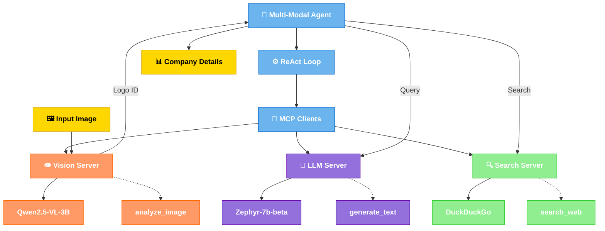

# Multi-Modal Agent with MCP Architecture


A production-ready multi-modal agent implementation using the Model Context Protocol (MCP) with a microservices architecture. This project demonstrates how to build a modern, maintainable AI agent that combines vision, language, and search capabilities to analyze images and provide comprehensive information.

## 🌟 Features

- **Multi-Modal Perception**: Combines vision and language understanding
- **Microservices Architecture**: Modular, scalable, and maintainable
- **Intel GPU Optimization**: Accelerated with Intel Extension for PyTorch
- **ReAct Agent Pattern**: Reasoning and Acting with perception capabilities
- **Docker Deployment**: Production-ready containerization
- **Standardized Communication**: Model Context Protocol (MCP) for all components

## 🏗️ Architecture



## 🧠 Agent Pattern: ReAct with Perception

This project implements the **ReAct (Reasoning + Acting) agent pattern with perception capabilities**, which combines:

1. **Perception**: Using vision models to understand and interpret images
2. **Reasoning**: Step-by-step thinking process to formulate plans and analyze information
3. **Acting**: Taking actions through tools to gather information and achieve goals

The ReAct pattern follows this loop:

1. **Observe**: Perceive the environment (image analysis)
2. **Think**: Reason about the observation and determine next steps
3. **Act**: Use tools to gather more information or take actions
4. **Repeat**: Continue the cycle until the task is complete

By adding perception capabilities to the ReAct pattern, our agent can process and reason about visual information, making it truly multi-modal.

## 🧩 Components

### Vision Server

The Vision Server provides image analysis capabilities through the Model Context Protocol:

- **Model**: Qwen2.5-VL-3B-Instruct (vision-language model)
- **Optimization**: Intel XPU acceleration with IPEX
- **Tools**: `analyze_image` for logo identification
- **Port**: 8000

### LLM Server

The LLM Server provides language understanding and reasoning capabilities:

- **Model**: Zephyr-7b-beta (instruction-tuned language model)
- **Optimization**: Intel XPU acceleration with IPEX
- **Tools**: `generate_text` and `answer_question`
- **Prompts**: ReAct agent prompt template
- **Port**: 8001

### Search Server

The Search Server provides web search capabilities for gathering information:

- **Engine**: DuckDuckGo search
- **Tools**: `search_web` and `search_company_info`
- **Port**: 8002

### Client Application

The Client Application orchestrates the multi-modal agent workflow:

- Connects to all MCP servers
- Implements the ReAct agent loop
- Coordinates tool calls across servers
- Manages error handling and recovery
- Provides the final results

## 🚀 Getting Started

### Prerequisites

- Python 3.8+
- Intel GPU with XPU support
- Intel Extension for PyTorch
- FastMCP 2.0

### Installation

1. Clone the repository:

```bash
git clone https://github.com/yourusername/multi-modal-agent.git
cd multi-modal-agent/mcp_agent
```

2. Install the required dependencies:

```bash
pip install -r requirements.txt
```

### Running Locally

1. Start the MCP servers:

```bash
python run_servers.py
```

2. Run the client application:

```bash
python client/agent_client.py
```

### Docker Deployment

For production deployment, use the Docker configuration:

```bash
cd docker
chmod +x build-and-run.sh
./build-and-run.sh
```

See the [Docker README](docker/README.md) for detailed deployment instructions.

## 📊 Performance Optimization

This implementation is optimized for Intel GPUs using Intel Extension for PyTorch (IPEX):

- **Mixed Precision**: Models use `torch.float16` for faster inference
- **IPEX Optimization**: `ipex.optimize()` applied to models
- **Inference Mode**: `torch.inference_mode()` for maximum efficiency
- **XPU Detection**: Automatic fallback to CPU if XPU is unavailable
- **Memory Management**: Efficient resource allocation across services

## 🔄 Workflow Example

1. **Image Analysis**:
   ```
   Input: logo1.png
   Output: "Apple Inc."
   ```

2. **Query Generation**:
   ```
   "Identify the company shown in the image as 'Apple Inc.' and give me its details like name, headquarters, website, and what it does."
   ```

3. **Agent Reasoning and Search**:
   ```
   Thought: I need to search for information about Apple Inc.
   Action: search_company_info
   Action Input: "Apple Inc."
   Observation: [Search results about Apple]
   ```

4. **Final Answer**:
   ```
   Company: Apple Inc.
   Headquarters: Cupertino, California, USA
   Website: apple.com
   Business: Consumer electronics, software, and online services
   ```

## 🛠️ Extending the Agent

### Adding New Tools

To add a new tool to an MCP server:

```python
@server.tool()
def new_tool(param1: str, param2: int) -> dict:
    """Tool description"""
    # Tool implementation
    return {"result": "value"}
```

### Adding New Servers

To add a new MCP server:

1. Create a new server file based on the existing templates
2. Add the server to `run_servers.py`
3. Update the client to connect to the new server

## 📚 References

- [Model Context Protocol (MCP)](https://modelcontextprotocol.info/)
- [FastMCP 2.0 Documentation](https://gofastmcp.com/getting-started/welcome)
- [ReAct: Synergizing Reasoning and Acting in Language Models](https://arxiv.org/abs/2210.03629)
- [Intel Extension for PyTorch](https://github.com/intel/intel-extension-for-pytorch)

## 📄 License

This project is licensed under the MIT License - see the LICENSE file for details.

## 🙏 Acknowledgments

- The FastMCP team for the Model Context Protocol implementation
- Intel for the PyTorch extension and XPU support
- The open-source AI community for models and tools
